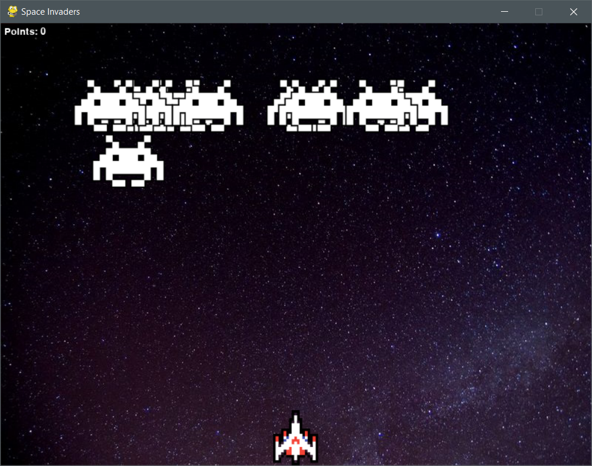
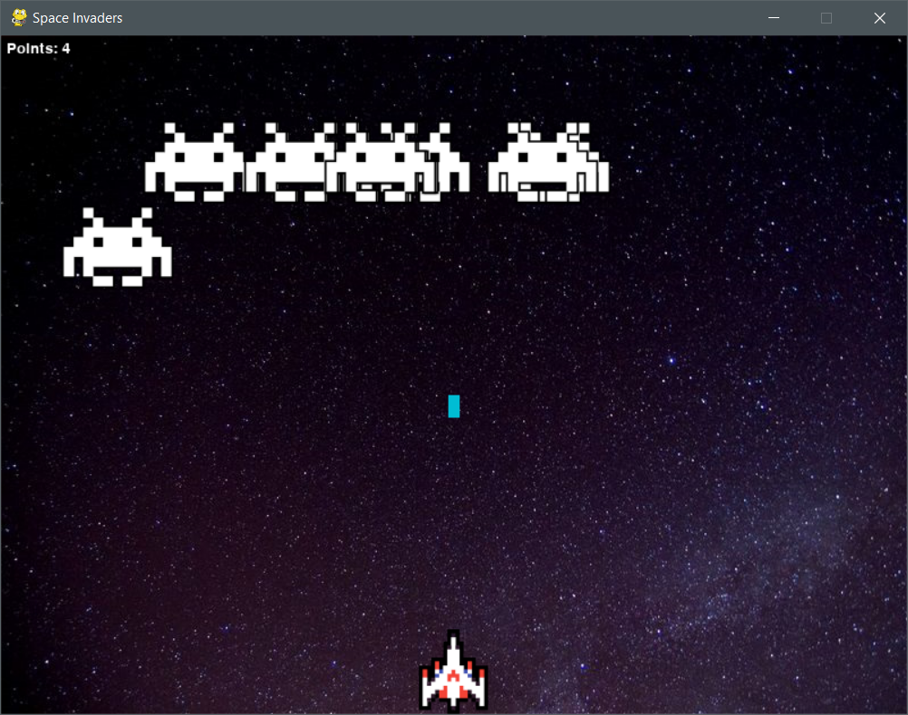
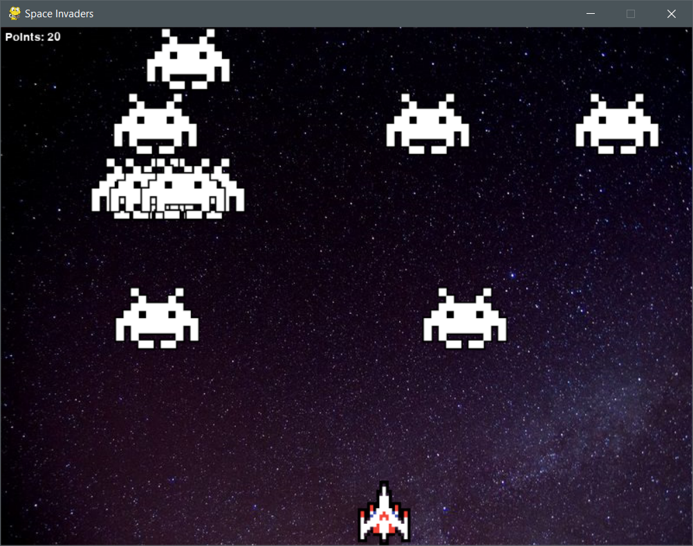
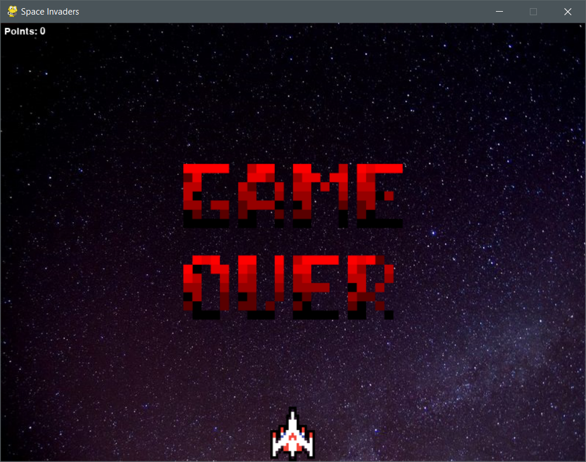

# Space Invaders

## Purpose
A project created for fun and improving skills.

## Dependencies
In [requirements.txt](https://github.com/Yrazec/space-invaders/blob/main/requirements.txt) you can find list of dependencies that will be necessary to run the project.

## Important
- The project is a standalone application that can be run from the CLI.

## Structure
Project contains 4 important files:
- [runner.py](https://github.com/Yrazec/space-invaders/blob/main/runner.py) - Runner file for Space Invaders.
- [/libs/configs.py](https://github.com/Yrazec/space-invaders/blob/main/libs/runner.py) - File containing all Space Invaders functionality.
- [/libs/utils.py](https://github.com/Yrazec/space-invaders/blob/main/libs/utils.py) - File containing helper classes and methods for Space Invaders.
- [/configs/configs.py](https://github.com/Yrazec/space-invaders/blob/main/configs/configs.py) - File containing configurations for Space Invaders.

## Content
The project implements Space Invaders using several interesting libraries. The game is completely independent and can be enjoyed for hours.

## Controls
- Left arrow - move left.
- Right arrow - move right.
- Space - shooting.

## Gameplay

#  
###### Cezary Pietruszyński ∙ [LinkedIn](https://www.linkedin.com/in/cezary-pietruszynski-tkd/)
_Yrazec is just Cezary but reversed!_
